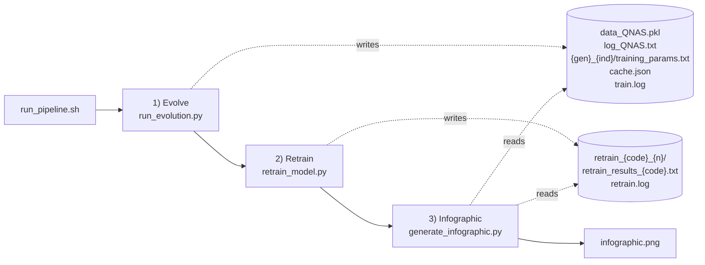
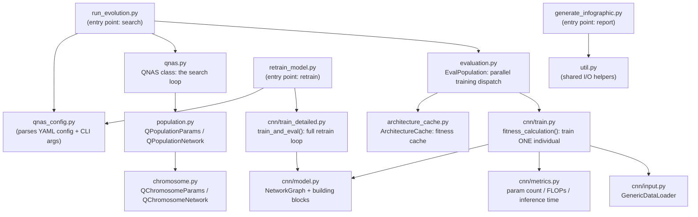
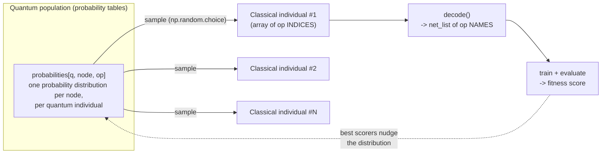
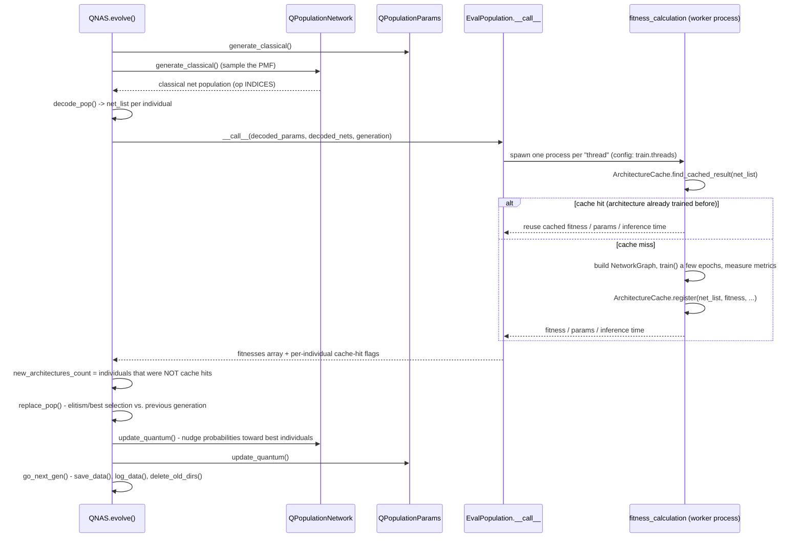
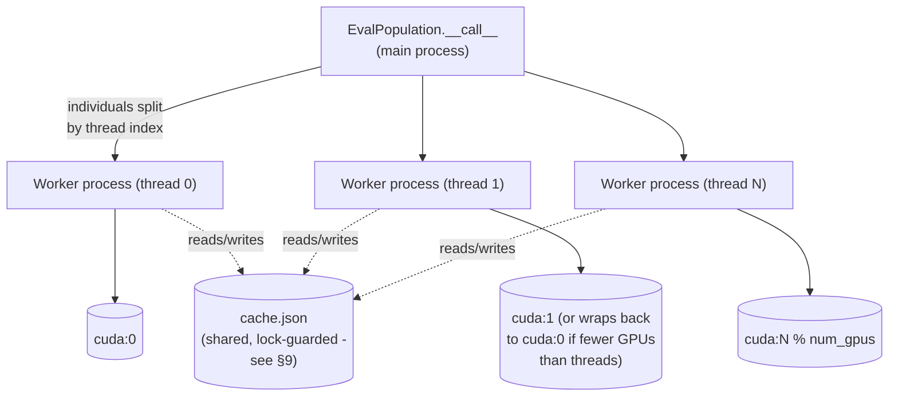
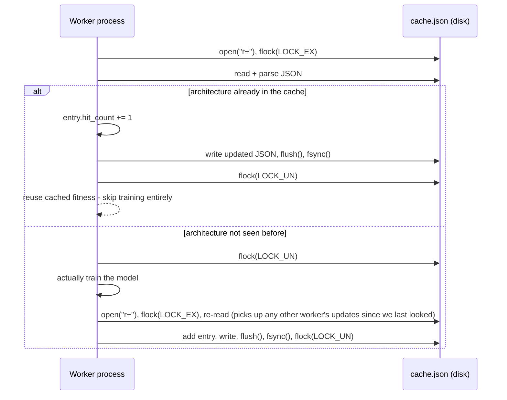
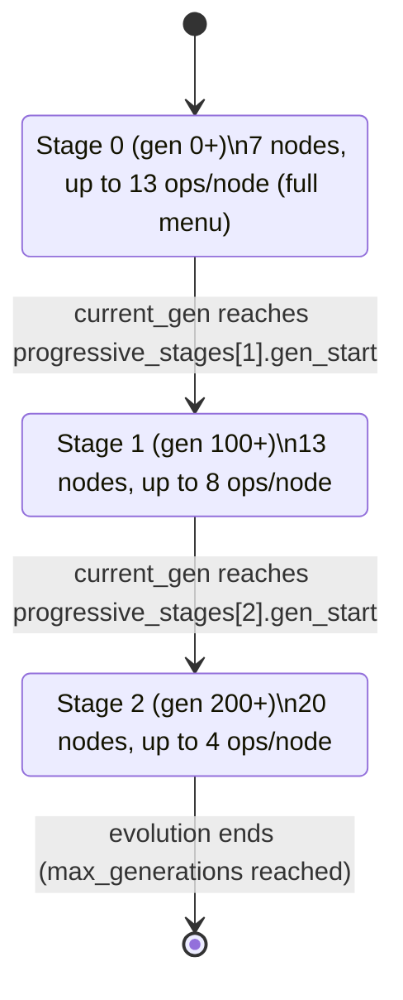
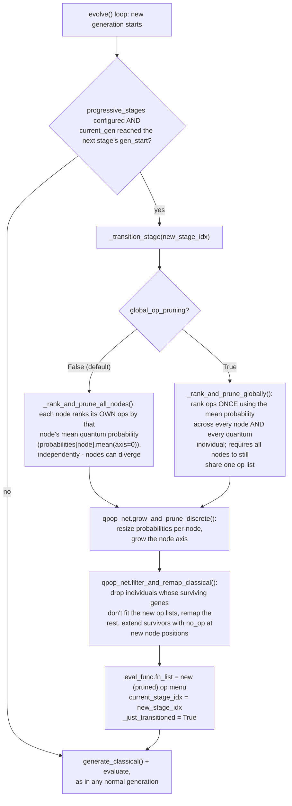
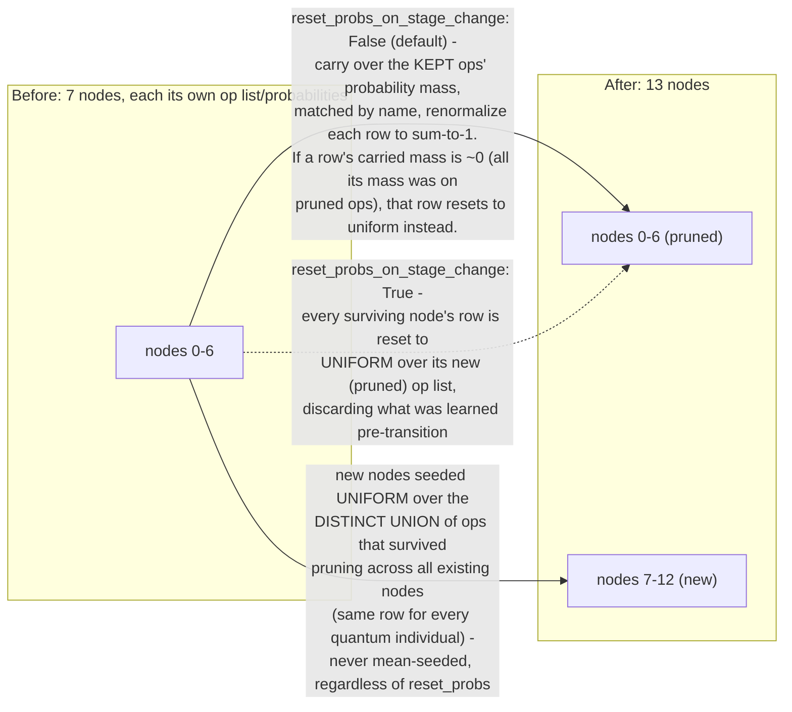

# Q-NAS Developer Documentation

This document explains how this repository's Q-NAS (Quantum-inspired Neural
Architecture Search) system works, from a "never seen this codebase before"
starting point. It covers the full pipeline, the core algorithm, the code
structure, and the artifacts each run produces. An appendix at the end covers
the P-DARTS-inspired progressive growth feature in detail.

No prior knowledge of NAS, evolutionary algorithms, or quantum computing is
assumed.

---

## 1. What problem does this solve?

Designing a good convolutional neural network (CNN) architecture by hand is
slow and requires expertise: how many layers, what kind (convolutions?
pooling? which kernel size?), in what order? **Neural Architecture Search
(NAS)** automates this: instead of a human designing the network, an
algorithm searches over many candidate architectures, trains each one
(briefly), measures how well it does, and uses that feedback to propose
better candidates.

**Q-NAS** is one such search algorithm. It is *quantum-inspired*, not
quantum computing — it does not require a quantum computer and runs entirely
on normal GPUs. "Quantum-inspired" refers to the mathematical trick it
borrows: instead of directly representing a population of candidate
networks, it represents a **probability distribution** over possible
networks (loosely analogous to a quantum system being in a "superposition"
of states), and repeatedly draws ("observes") concrete candidate networks
from that distribution, evaluates them, and nudges the distribution toward
whatever tends to work well. Over many rounds, the distribution converges
toward architectures that train well on the target dataset.

The end-to-end product of a Q-NAS run is: **one discovered CNN
architecture**, retrained properly, plus a one-page visual report
(`infographic.png`) summarizing the whole search.

---

## 2. The three-phase pipeline

A full run has three phases, normally invoked together via
`scripts/run_pipeline.sh`:



1. **Evolve** (`src/run_evolution.py`) — runs the search itself: many
   *generations* of candidate architectures are generated, trained briefly,
   and scored. This is where the bulk of the "intelligence" lives.
2. **Retrain** (`src/retrain_model.py`) — takes the single best architecture
   found by the search and trains it properly (full dataset, many more
   epochs) to get a realistic final accuracy number. The search phase
   intentionally trains each candidate only briefly (often on a *subset* of
   the data) just to rank architectures relative to each other cheaply —
   retrain is where you get the "real" number.
3. **Infographic** (`src/generate_infographic.py`) — reads everything the
   previous two phases produced and renders a single PNG report: fitness
   over generations, the best network found, search-vs-retrain accuracy,
   timing, etc.

Each step can be skipped (`-S evolve,retrain,infographic`), e.g. to
regenerate only the infographic from an already-finished run.

---

## 3. Core vocabulary

| Term | Meaning here |
|---|---|
| **Individual** | One candidate CNN architecture (plus a few training hyperparameters). |
| **Node / gene** | One "slot" in the architecture — the network is a straight sequence of nodes, and each node holds one operation (e.g. a 3x3 convolution, or "do nothing"). |
| **Op / function** | One concrete building block a node can hold — e.g. `conv_3_1_64` (3x3 conv, 64 filters), `mbconv_5_1_32`, `no_op` (skip this node entirely). The set of ops available to choose from is the `function_dict` in a config file. |
| **`net_list`** | An individual's architecture *decoded* into a plain list of op names, in order, e.g. `['no_op', 'conv_3_1_64', 'mbconv_3_1_32', ...]`. This is the human-readable form of an architecture. |
| **Chromosome** | The encoded (numeric) form of an individual before decoding — either an array of op *indices* (network chromosome) or an array of hyperparameter values (params chromosome). |
| **Population** | The set of individuals considered in one generation. |
| **Generation** | One round of the search loop: sample individuals → train/score them → update the search distribution. |
| **Fitness** | The score assigned to an individual after training it briefly (accuracy, loss, or a combined metric — configurable). |
| **Quantum individual / classical individual** | See §5 below — this is the central trick of the algorithm. |

---

## 4. Codebase map



Two other entry points exist but are outside the Q-NAS loop itself:
`train_resnet.py` (a standalone ResNet baseline trainer, for comparison) and
`cnn/fine_tune_cnn.py` (fine-tunes an already-trained `best_model.pth` on a
new dataset).

---

## 5. The quantum-inspired representation

This is the one idea that makes Q-NAS different from a "plain" genetic
algorithm.

A plain genetic algorithm would keep a population of concrete architectures
and mutate/crossover them directly. Q-NAS instead keeps, **for each node
position, a probability distribution over which op is likely to go there**.
This is `QPopulationNetwork.probabilities`, a **list of length `num_nodes`**,
one `[num_quantum_individuals, num_ops_at_that_node]` array per node — for
every "quantum individual" (think of it as one evolving probability table)
and every node, it holds a probability for each candidate op, summing to 1
per node. It's kept as a ragged Python list rather than one dense 3-D array
because different nodes can end up with different op menus (of possibly
different sizes) after a progressive-growth op prune — see Appendix A. Each
node also has its own `chromosome.fn_list[node]` (the ordered op names that
row's probabilities line up with); outside of progressive growth every node
starts with an identical `fn_list`/`num_ops`, so the "3-D array" mental model
still holds in that common case.

Every generation, **concrete (classical) individuals are sampled** from this
distribution (`generate_classical()`, using `np.random.choice` weighted by
the probabilities), decoded into real `net_list`s, actually trained, and
scored. The distribution is then nudged toward whatever the best-performing
classical individuals looked like (`update_quantum()`) — ops that keep
winning become more probable, ops that keep losing become less probable.



The same trick is applied to a handful of training **hyperparameters**
(learning rate, momentum, weight decay, LR decay) via a parallel, simpler
`QPopulationParams` — instead of discrete probabilities per op, it tracks a
shrinking `[lower, upper]` numeric range per hyperparameter that is sampled
uniformly and narrows toward good values over time.

`repetition` (a config value) controls how many classical individuals are
sampled per quantum individual each generation — e.g. `num_quantum_ind=5,
repetition=4` means 5 probability tables, 20 classical individuals trained
per generation.

---

## 6. One generation, step by step

This is the loop inside `QNAS.evolve()` (`src/qnas.py`), run once per
generation:



Key methods, and where to find them:

- **`generate_classical`** (`qnas.py`) — samples the classical population
  from the quantum probability tables, applies optional crossover, and
  triggers evaluation.
- **`decode_pop` / `eval_pop`** (`qnas.py`) — turns raw numeric chromosomes
  into `net_list`s and hyperparameter dicts, hands them to
  `EvalPopulation`, and — once fitnesses and per-individual cache-hit flags
  come back — sets `new_architectures_count` to how many individuals were
  **not** cache hits this generation (see §9, §10).
- **`EvalPopulation.__call__`** (`evaluation.py`) — the parallel dispatcher;
  see §7.
- **`fitness_calculation`** (`cnn/train.py`) — trains and scores exactly one
  individual; see §8.
- **`replace_pop`** (`qnas.py`) — decides which individuals survive into the
  next generation: `elitism` keeps only the single best individual from the
  old population and replaces everyone else; `best` keeps the best-N of the
  *union* of old and new populations. Also tracks `best_so_far` /
  `best_so_far_id`.
- **`update_quantum`** (`qnas.py` → `population.py`) — every
  `update_quantum_gen` generations, shifts each probability table's mass
  toward the op choices of its best classical individuals (and shrinks the
  hyperparameter ranges similarly). This is the actual "learning" step of
  the search.
- **`go_next_gen`** (`qnas.py`) — persists `data_QNAS.pkl`, writes a summary
  to `log_QNAS.txt`, and deletes per-individual training folders for
  everyone except the current best (`delete_old_dirs`), to avoid
  accumulating gigabytes of checkpoints.

---

## 7. Parallel evaluation

`EvalPopulation` (`src/evaluation.py`) is responsible for actually training
a generation's individuals as fast as the available hardware allows. It
splits the population across `train.threads` worker **processes** (not
threads — `torch.multiprocessing.Process`), round-robining them across the
available GPUs.



Each worker process runs `run_individuals`, which calls
`cnn.train.fitness_calculation` once per individual assigned to it, in a
simple loop (individuals within one worker process are trained
sequentially; parallelism comes from having multiple worker processes).

`EvalPopulation.__init__` builds one `GenericDataLoader` (`cnn/input.py`)
shared for the whole run. By default (`train.use_seed: True`, the default,
with `train.seed` defaulting to a fixed constant) it seeds Python/NumPy/
`sklearn`'s `StratifiedShuffleSplit` explicitly, so the train/validation
split — and the subset picked when `limit_data` is on — is identical every
time `get_loader()` is called, across every generation, worker thread, and
individual. Before this, the split re-ran against unseeded global RNG state
on every call, so two individuals in the same generation (or the same
architecture reappearing in a later generation) could silently be scored
against different data, undermining the fitness comparisons the whole
search depends on. Set `train.use_seed: False` to opt back into a fresh
random split per run (still internally consistent within that one loader's
lifetime).

---

## 8. Training one individual (`fitness_calculation`)

For a single individual, `cnn/train.py`'s `fitness_calculation`:

1. Checks the **architecture cache** first (§9) — if this exact `net_list`
   was already trained (by this or an earlier generation), it reuses the
   cached fitness/params/inference-time and returns immediately, with no
   model built at all.
2. Otherwise, builds the actual PyTorch model: `cnn/model.py`'s
   `NetworkGraph` walks the `net_list` and instantiates the corresponding
   `nn.Module` for each op name (looked up in `functions_dict`, e.g.
   `ConvBlock`, `MBConv`, `ResidualV1`, pooling ops, `NoOp`), chaining them
   sequentially with a final classifier head.
3. Trains it for a short, configurable number of epochs (`train()` in the
   same file), tracking training/validation loss and accuracy each epoch,
   with optional per-individual early stopping (config:
   `early_stopping_enabled`/`_patience`/`_min_delta`) — this monitors
   whichever metric `fitness_metric` (step 5 below) actually optimizes for
   — accuracy or loss — not always validation loss, so a model whose
   accuracy is still improving isn't killed by a stalled/noisy loss it
   isn't even being scored on. Two optional performance features apply
   here too: `train.mixed_precision` (AMP, `torch.autocast`/`GradScaler`)
   and `train.channels_last` (NHWC memory format — lets cuDNN pick its
   fastest Tensor Core conv kernels on Ampere+ GPUs under AMP, typically
   1.2-1.4x faster; changes only the tensors' physical memory layout, not
   their logical NCHW shape or the resulting numbers).
4. Measures parameter count, FLOPs, and CUDA inference time
   (`cnn/metrics.py`).
5. Computes the **fitness** from whichever metric the config selects:
   `best_accuracy`, `best_loss`, or `scalar_multi_objective` (a combined
   score that also penalizes large parameter counts / slow inference — see
   `cnn/fitness_utils.py`).
6. Saves `best_model.pth` and `training_params.txt` (a YAML dump of
   everything about this individual — architecture, hyperparameters,
   metrics, generation/individual id) into `{experiment_path}/{gen}_{ind}/`.
7. Registers the result into the architecture cache.

---

## 9. The architecture cache (fitness cache)

**Purpose**: evolutionary search naturally re-proposes the same
architecture more than once — most commonly because `elitism`/`best`
selection carries the previous best individual forward unchanged into the
next generation. Retraining the *exact same* architecture from scratch
every time it reappears is wasted GPU time. The `ArchitectureCache`
(`src/architecture_cache.py`) avoids that: it's a simple `{architecture ->
fitness}` map, keyed on the literal `net_list` (joined into a string like
`"no_op|conv_3_1_64|mbconv_3_1_32"`), with **no model weights involved at
all** — reusing weights was deliberately dropped in favor of just reusing
the scalar result, since re-loading/fine-tuning weights would be far more
complex for comparatively little benefit here.

It is always on (`EvalPopulation` creates it unconditionally - there is no
config flag to disable it) and lives in a single `experiment_path/cache.json`,
shared across the *entire* run (all progressive-growth stages included —
see the Appendix; different stages naturally produce
differently-shaped/differently-named architectures, so their cache keys
never collide).

**Concurrency**: because multiple worker *processes* train individuals at
the same time (§7), and any of them might hit or update the same cache
entry, `cache.json` is never read into memory and kept around — every
lookup and every update re-opens the file and holds an OS-level advisory
lock (`fcntl.flock`) for the entire read-modify-write, flushing to disk
before releasing the lock:



Each cache entry stores `fitness`, `params_m` (millions of parameters),
`inference_us`, and `hit_count` — the number of times that exact
architecture has been reused from the cache (useful for spotting how much
the population has converged / how much redundant search is happening).

---

## 10. What gets written to disk, and where

All of the following live directly under `experiment_path` (the `-e` folder
passed to `run_pipeline.sh`):

| File / folder | Written by | Contents |
|---|---|---|
| `log_QNAS.txt` | `qnas.py` (`log_data`) | Human-readable per-generation summary: generation number, active progressive-growth stage (if any), **number of new architectures discovered this generation** vs. already-seen ones, best fitness so far, full fitness list. |
| `data_QNAS.pkl` | `qnas.py` (`save_data`) | Machine-readable, cumulative per-generation snapshot (fitnesses, quantum probabilities, population arrays, current stage) — used to resume a run (`--continue_path`) and to build the infographic. |
| `log_params_evolution.txt` | `qnas_config.py` | A dump of the exact config used for this run (for reproducibility). |
| `train.log` | `cnn/train.py` + `evaluation.py` | Every training-phase log line (per-individual progress, per-generation timing) — see note below. |
| `retrain.log` | `retrain_model.py` + `cnn/train_detailed.py` | Every retrain-phase log line. |
| `cache.json` | `architecture_cache.py` | The fitness cache (§9), always created. |
| `{gen}_{ind}/` | `cnn/train.py` | One folder per individual trained (search phase) — `best_model.pth`, `training_params.txt`, `best_accuracy.txt`. Deleted at the end of each generation for everyone except the current best (`util.delete_old_dirs`), to bound disk usage. |
| `retrain_{code}_{n}/` | `cnn/train_detailed.py` | One folder per retrain repetition — `best_model.pth`, `training_params.txt`. |
| `retrain_results_{code}.txt` | `retrain_model.py` | Aggregated retrain metrics across repetitions. |
| `infographic.png` | `generate_infographic.py` | The final report. |

Both `train.log` and `retrain.log` are attached lazily, the first time each
logger sees `experiment_path`, precisely so that logs land next to the run
they belong to instead of some fixed, repo-wide location — important since
many experiments can exist side by side, and a worker process may be
re-used across a run's whole lifetime.

The **new-architectures-discovered** count (`log_QNAS.txt`) is derived
directly from the architecture cache's real hit/miss outcome for each
individual, not a separate approximation: `cnn/train.py`'s
`fitness_calculation` reports whether each individual was a cache hit back
through `EvalPopulation.__call__`, and `QNAS.eval_pop` counts how many
individuals in the generation were **not** cache hits (i.e. were actually
trained this generation) - see §9.

---

## 11. Retrain phase

The search phase deliberately trains each candidate architecture *briefly*
(few epochs, often on a reduced dataset subset via `limit_data`/
`limit_data_value`) — that's enough to rank architectures against each
other, but not enough for a trustworthy final accuracy number. `retrain_model.py`:

1. Reads the best architecture's `net_list` back out of its
   `training_params.txt` (via `qnas_config.load_evolved_data` — it looks
   for whichever `{gen}_{ind}` folder survived `delete_old_dirs`, which is
   guaranteed to be the best one).
2. Rebuilds the *same* architecture from scratch (fresh weights — nothing
   is reused from the search phase's brief training).
3. Trains it on the **full** dataset (retrain does not apply
   `limit_data`/`limit_data_value` by default) for `max_epochs` (config:
   `-E`, default 300) — this is normally the slowest single step of the
   whole pipeline, by design.
4. Repeats `num_repetitions` times (different random seeds) to get a sense
   of variance, and averages the results.

---

## 12. Infographic

`generate_infographic.py` assembles a single PNG from everything above:
fitness-over-generations curve, accuracy-vs-model-size scatter, the best
network's operation sequence, progressive-stage growth (if used), search
vs. retrain timing and accuracy, and headline stat tiles. It's entirely a
read-only consumer of the artifacts in §10 — it doesn't re-run or re-train
anything.

---

## Appendix A: P-DARTS-inspired progressive growth

### A.1 What P-DARTS is, in plain terms

[P-DARTS](https://arxiv.org/abs/1904.12760) ("Progressive DARTS") is a NAS
technique built around one observation: searching over a *deep* network
with a *large* menu of candidate operations from the very first step is
expensive and can behave poorly, because the search has to consider many
weak/incompatible combinations before anything sensible emerges. P-DARTS'
answer is to search in **stages**: start shallow with the full operation
menu, then progressively grow the network **deeper** while simultaneously
**shrinking** the operation menu (dropping operations that aren't proving
useful), so that later, more expensive/deeper stages only have to consider
a smaller, already-promising set of choices.

The original P-DARTS paper builds this on top of DARTS, a *different* NAS
family that represents the whole operation menu as a continuously
differentiable "mixture" (all candidate ops run in parallel, weighted by
learned continuous coefficients, and gradient descent tunes those weights —
this needs a shared "supernet" holding every candidate op's weights at
once). **This repository does not use that approach.** An earlier version
of this codebase did implement a DARTS/MixedOp-style continuous relaxation,
but it was reverted in favor of returning to the original, fully **discrete**
quantum-inspired search described in §5 above (individuals are always
concrete, single-path architectures — never a weighted mixture). What was
kept, and re-implemented for the discrete representation, is P-DARTS'
*progressive growth idea itself*: grow depth, shrink the op menu, in
stages.

### A.2 Configuring stages

A config file opts in with a `progressive:` block under `QNAS:`, grouping the
stage list together with the two tuning flags below and an explicit
`enabled` switch:

```yaml
QNAS:
  progressive:
    enabled: True   # optional tri-state, see below

    stages:
      - {gen_start: 0,   num_nodes: 7,  num_ops: 13}
      - {gen_start: 100, num_nodes: 13, num_ops: 8}
      - {gen_start: 200, num_nodes: 20, num_ops: 4}

    # Optional, both default False - see A.3.
    reset_probs_on_stage_change: True
    global_op_pruning: False
```

Each stage entry says: "starting at generation `gen_start`, the network has
`num_nodes` nodes and a menu of up to `num_ops` candidate operations per
node." Stage 0 must start at generation 0 and must use the *full* operation
menu (there's nothing to prune yet). Later stages grow `num_nodes` (deeper
networks) and shrink `num_ops` (fewer choices per node).

`progressive.enabled` is a tri-state, letting a config keep its `stages`
list on file without it being active:

- absent (or the whole `progressive:` block absent) — inferred from whether
  `stages` is set, i.e. plain QNAS (identical to `main`'s behavior) unless a
  config opts in with a `stages` list.
- `False` — forces plain (non-progressive) QNAS even if `stages` is present.
- `True` — requires `stages` to be set; raises a config error otherwise.

Two independent flags (both default to `False`) tune how a transition
prunes/carries over the search's existing knowledge; see A.3 for what each
one actually changes:

- `reset_probs_on_stage_change` — forget vs. carry over the learned PMF for
  ops that survive the prune.
- `global_op_pruning` — rank/prune ops once for the whole network vs.
  independently per node (the default; lets different node positions settle
  on different surviving ops).



### A.3 How a transition actually happens

Every generation, `QNAS.evolve()` checks whether the current generation has
reached the next configured stage's `gen_start`; if so, it calls
`_transition_stage` (`src/qnas.py`) before generating that generation's
population:



**Op pruning** (`_rank_and_prune_ops`, called by whichever of the two
ranking modes above is active) needed a replacement for what the
now-removed DARTS/MixedOp version used (a per-op weight *learned by
gradient descent* inside a continuous supernet — not available here, since
there is no supernet). The discrete stand-in reuses something the search
already maintains for free: `QPopulationNetwork.probabilities`, the
quantum-inspired PMF from §5. Since ops that have been performing well tend
to accumulate probability mass over generations (that's exactly what
`update_quantum` does), averaging each op's probability gives a reasonable
"how promising has this op been so far" signal, with no extra machinery
needed. The no-op is never eligible for pruning — it's excluded from the
ranking pool and unconditionally kept (spending one of `num_ops` slots), so
there is always a no-op available to pad newly grown node positions (see
below) without invalidating a surviving individual's fitness.

Two modes decide *which* mean to rank by (config: `global_op_pruning`,
default `False`):

- **Per-node (default)** — `_rank_and_prune_all_nodes` ranks each node's own
  op list by that node's own mean probability across quantum individuals
  only (`probabilities[node].mean(axis=0)`) and keeps that node's own top
  `num_ops`. Different node positions can end up keeping a different subset
  of ops — e.g. node 0 might settle on convolutions while a later node keeps
  pooling ops.
- **Global** (`global_op_pruning: True`) — `_rank_and_prune_globally` ranks
  every op once using the mean probability across *every* node and *every*
  quantum individual, and applies that single surviving list to all nodes
  uniformly — the older, network-wide-only behavior. This requires every
  node to still share an identical op list at the point of the transition
  (raises if per-node pruning was ever used before it, since a network-wide
  mean isn't well-defined once nodes have diverged onto different op sets).

```python
mean_weight = probabilities[node].mean(axis=0)  # per-node mode: one score per op, this node only
# or, global mode:
mean_weight = np.stack(probabilities, axis=1).mean(axis=(0, 1))  # one score per op, network-wide
# rank ops by mean_weight (no-op excluded/always kept), keep the top `num_ops`, preserve original order
```

**Resizing the population** (`grow_and_prune_discrete`,
`src/population.py`) then updates `probabilities` (still the ragged,
per-node list from §5) and `chromosome.fn_list` node by node:



New nodes are seeded uniformly over the *union* of surviving ops (not
mean-seeded from the surviving nodes' distributions, and not affected by
`reset_probs_on_stage_change`, since there is no prior for a brand-new node
position to reset or carry over in the first place) — simpler than the
mean-seeding this repository used previously, and avoids biasing a new node
toward whichever surviving node happened to have the most mass concentrated
on a single op.

Renormalizing after dropping ops matters: `generate_classical()` samples
each node with `np.random.choice(..., p=probabilities[node][...])`, which
requires that node's probabilities to sum to 1 — simply deleting the pruned
ops' columns without renormalizing would leave a row summing to less than 1.

### A.4 A subtlety: carrying the classical population across a transition

Growing `num_nodes` and pruning each node's op menu both change the
*shape/meaning* of every individual's chromosome (an architecture is an
array of `num_nodes` op indices, each index into that node's own op list) —
a chromosome from before the transition can't be directly compared or
merged with one from after. Rather than discarding the whole classical
population at every transition (which would throw away already-evaluated
fitness for individuals that are still perfectly valid),
`filter_and_remap_classical` (`src/population.py`, called from
`_transition_stage`) individual-by-individual:

- For each pre-existing node, looks up the op name that individual's gene
  currently encodes. If that op didn't survive the prune at that node, the
  **whole individual is dropped** — its network is no longer decodable in
  the new op menu, so its old fitness no longer means anything.
- Otherwise, remaps that gene to the op's new index (pruning can reorder a
  node's surviving ops), and pads any newly grown node positions with the
  no-op's index — a no-op is a computational identity, so extending a
  surviving individual with it doesn't change what its already-measured
  fitness describes; it does **not** need to be retrained just because the
  population grew deeper.

The individuals that pass this filter keep their fitness from before the
transition and are carried straight into the current population
(`current_pop`, `fitnesses`, `raw_fitnesses` are all filtered/remapped
together); the individuals that get dropped are simply gone until the next
`generate_classical()` call resamples fresh ones from the (freshly
resized) quantum distribution to refill the population. If *no* individual
survives the prune, `current_pop` is set to `None` and `QNAS` logs a
warning — the next generation starts from scratch on the new op menu, same
as before this mechanism existed.

`QNAS` still treats the first post-transition generation as special
(`_just_transitioned` flag) so `replace_pop`'s normal
`elitism`/`best` merge logic — which assumes old and new populations share
a chromosome shape — isn't applied across the boundary; the
filter-and-remap step above is what replaces it. `best_so_far` (the best
fitness recorded across the *entire* run) is preserved correctly across a
transition regardless of how many individuals survive the filter — it is
never allowed to decrease, since a partially-refilled or freshly-resampled
population may score lower than a well-optimized previous stage until it
catches up.

### A.5 Why no weight transfer between stages

An earlier design of this feature also carried the previous stage's best
individual's *trained weights* forward into the next (larger) stage, to
warm-start it instead of training from scratch. This was deliberately
dropped: unlike a DARTS-style shared supernet (where "warm-starting"
means copying weights between structurally-compatible mixture modules),
here every individual is an independent, single-path concrete network, so
warm-starting would require inventing a layer-matching heuristic between
two differently-shaped, differently-sized networks — a lot of complexity
for uncertain benefit. This is distinct from what A.4 describes: A.4's
`filter_and_remap_classical` carries forward an individual's already-known
*fitness score* (a scalar) across a stage boundary when its architecture is
still valid under the new op menu, which needs no layer-matching at all —
it's the same kind of reuse the architecture cache (§9) already does within
a stage, just applied across the transition instead of skipped there.
*Weights* are a different matter: within a stage, if the *exact same*
architecture reappears (which happens often, e.g. via elitism carrying an
individual forward unchanged), the architecture cache reuses its fitness
without retraining, but there are never any weights to reuse either way -
the cache only ever stores the scalar result (§9). Across a stage boundary,
even a surviving individual's `net_list` differs from before (deeper, and
possibly re-indexed), so it is retrained from scratch to get a fitness
number that's valid at the new depth/op menu - only individuals whose op at
every pre-existing node happened to survive pruning skip that retrain, via
A.4's mechanism, and only for the fitness they already had *before* growing
deeper.
