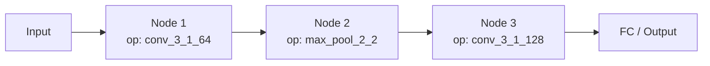
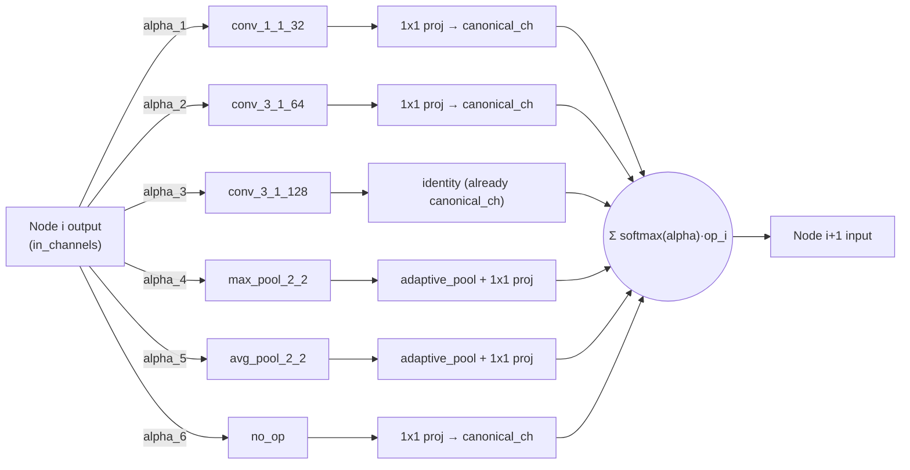
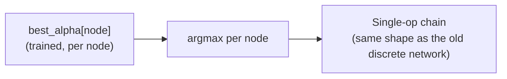
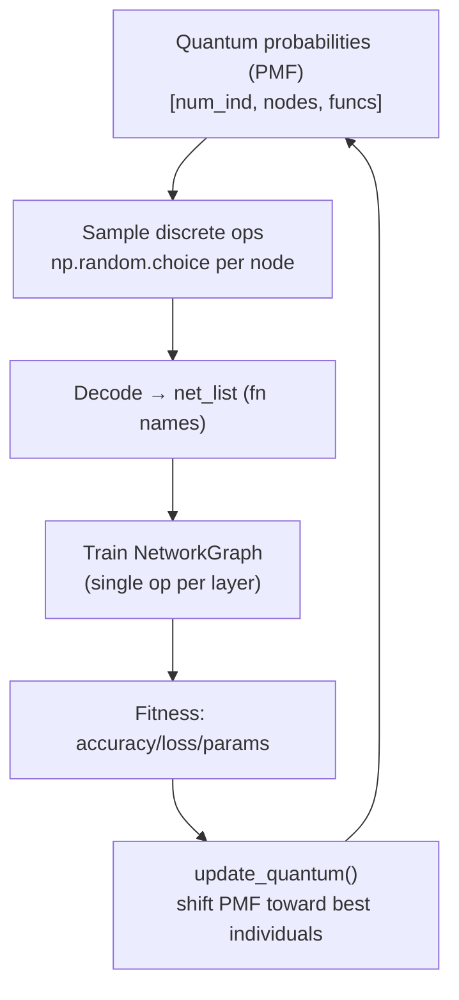
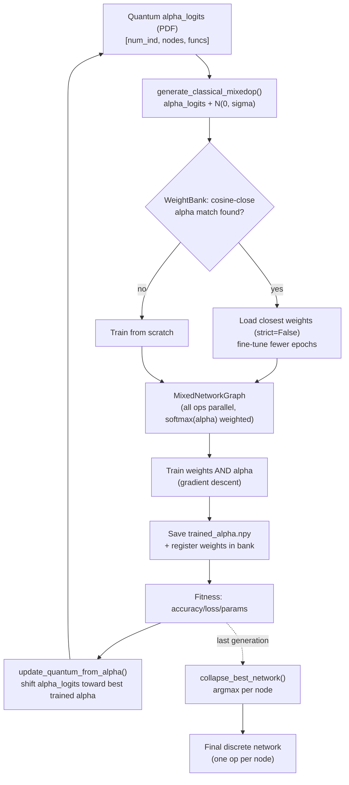

# QNAS: Discrete (PMF) vs MixedOp (PDF) — Architecture & Flow Diagrams

Comparison of the original discrete-sampling QNAS design and the new `mixedop_mode`
(DARTS-style MixedOperation with alpha-based weight reuse).

## 1. Network architecture — nodes & edges

### Old: discrete chain (one operation sampled per node)

Each node has exactly **one incoming edge type** — the operation chosen by
`np.random.choice` from the PMF (`src/population.py: generate_classical`).

### New: MixedOp node (all operations in parallel, softmax(alpha)-weighted edges)

Every node fans out to **all candidate ops simultaneously** (edges weighted by
`softmax(alpha)`), aligned in channels/spatial size, then summed — this is `MixedOp` in
[`src/cnn/mixed_model.py`](../src/cnn/mixed_model.py).

### End of evolution: collapse back to a discrete chain

This is the `collapse_best_network()` step in [`src/qnas.py`](../src/qnas.py), run once
at the end of `evolve()` when `mixedop_mode` is enabled.

## 2. Evolutionary flow

### Old flow

### New flow

