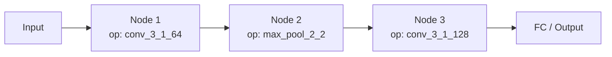
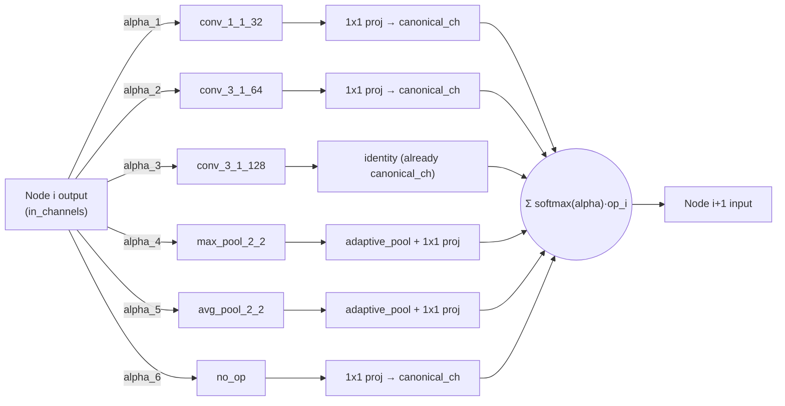
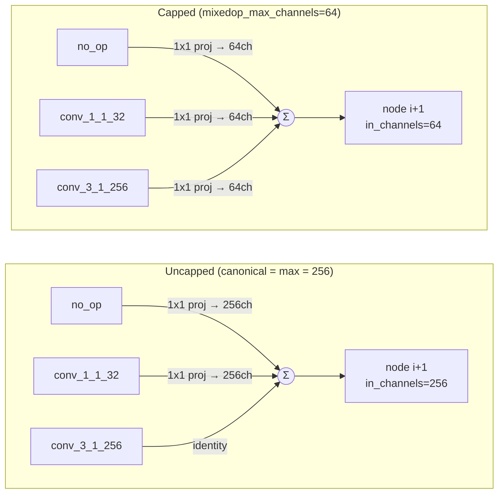
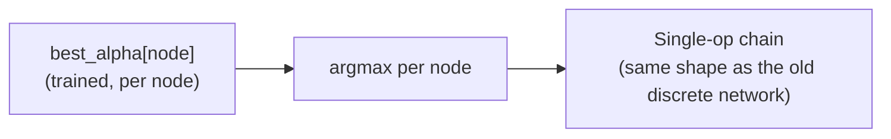
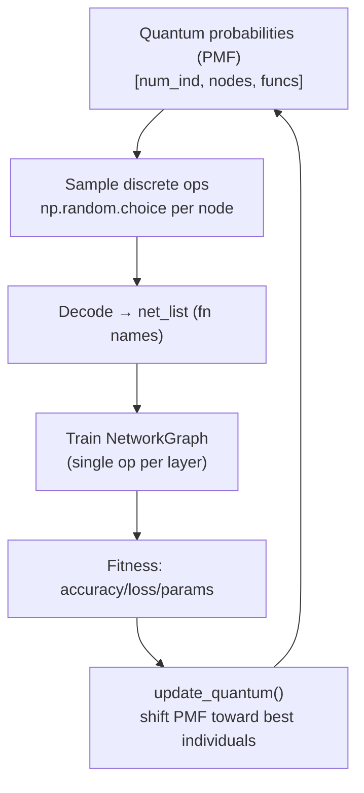
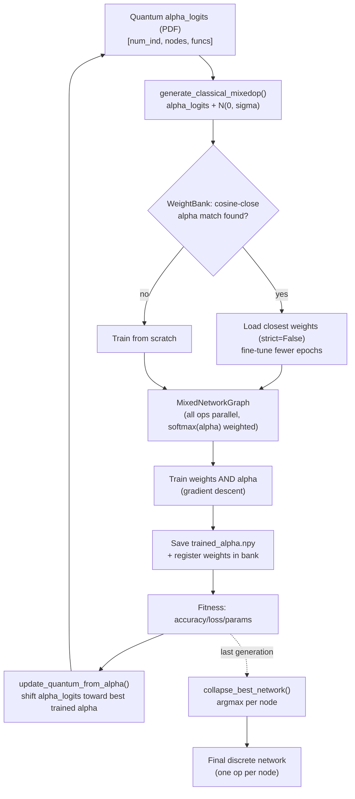

# QNAS: Discrete (PMF) vs MixedOp (PDF) — Architecture & Flow Diagrams

Comparison of the original discrete-sampling QNAS design and the new `mixedop_mode`
(DARTS-style MixedOperation with alpha-based weight reuse).

## 1. Network architecture — nodes & edges

### Old: discrete chain (one operation sampled per node)

Each node has exactly **one incoming edge type** — the operation chosen by
`np.random.choice` from the PMF (`src/population.py: generate_classical`).

### New: MixedOp node (all operations in parallel, softmax(alpha)-weighted edges)

Every node fans out to **all candidate ops simultaneously** (edges weighted by
`softmax(alpha)`), aligned in channels/spatial size, then summed — this is `MixedOp` in
[`src/cnn/mixed_model.py`](../src/cnn/mixed_model.py).

### Memory optimization: capped canonical channel width (PC-DARTS-style)

By default, `canonical_out_channels` at each node is `max()` over every candidate op's
output width. With a `fn_list` that includes a wide conv (e.g. `conv_3_1_256`), **every**
op — including cheap ones like `no_op` and `max_pool_2_2` — gets projected up to 256
channels before the weighted sum, and that width then becomes the next node's
`in_channels`, compounding across all `max_num_nodes` layers.

Setting `mixedop_max_channels` in the config's `train:` section (see
`config_mixedop.yml`) caps `canonical_out_channels` at that value instead of following
the widest op. This is the same idea PC-DARTS uses to bound search-time memory: every
op's output — even the naturally-wide one — gets projected down to the cap, so channel
width no longer grows unboundedly with the widest entry in `fn_list`. Because the capped
width also becomes the next node's `in_channels`, the saving compounds with depth
(conv FLOPs/activation memory scale with `in_channels × out_channels`), which is why a
modest cap (e.g. 64 vs. 256) cuts total parameters by ~75% in practice.

Trade-off: the wide op's own internal computation is unaffected (it still runs at its
configured filter count, e.g. 256, before being projected down), so it doesn't reduce
that op's own peak activation — only what propagates onward. It does mean a wide op's
full representation is squeezed through the same bottleneck as every other candidate,
which can bias the learned alpha logits against wide/expensive ops during search. This
only affects the search-time proxy: `collapse_best_network()` only keeps the winning
*operation names*, and the retrain phase rebuilds the discrete network via
`NetworkGraph.create_functions()` at each op's full native width — uncapped.
Implementation: `MixedOp`/`MixedNetworkGraph.create_mixed_ops()` in
[`src/cnn/mixed_model.py`](../src/cnn/mixed_model.py); read from the config in
[`src/qnas_config.py`](../src/qnas_config.py) (config-file only, no CLI flag).

### End of evolution: collapse back to a discrete chain

This is the `collapse_best_network()` step in [`src/qnas.py`](../src/qnas.py), run once
at the end of `evolve()` when `mixedop_mode` is enabled.

## 2. Evolutionary flow

### Old flow

### New flow

