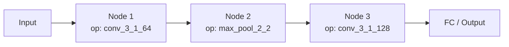
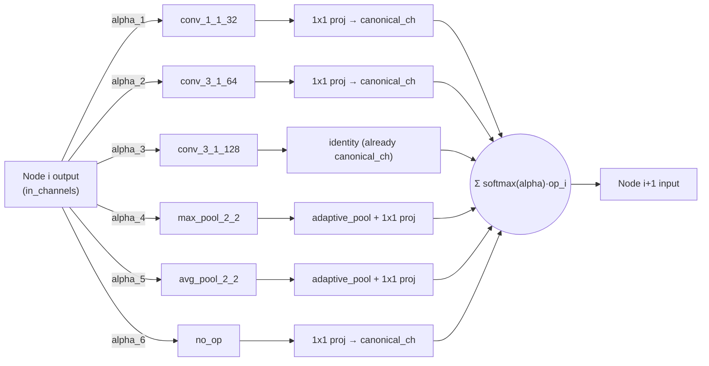
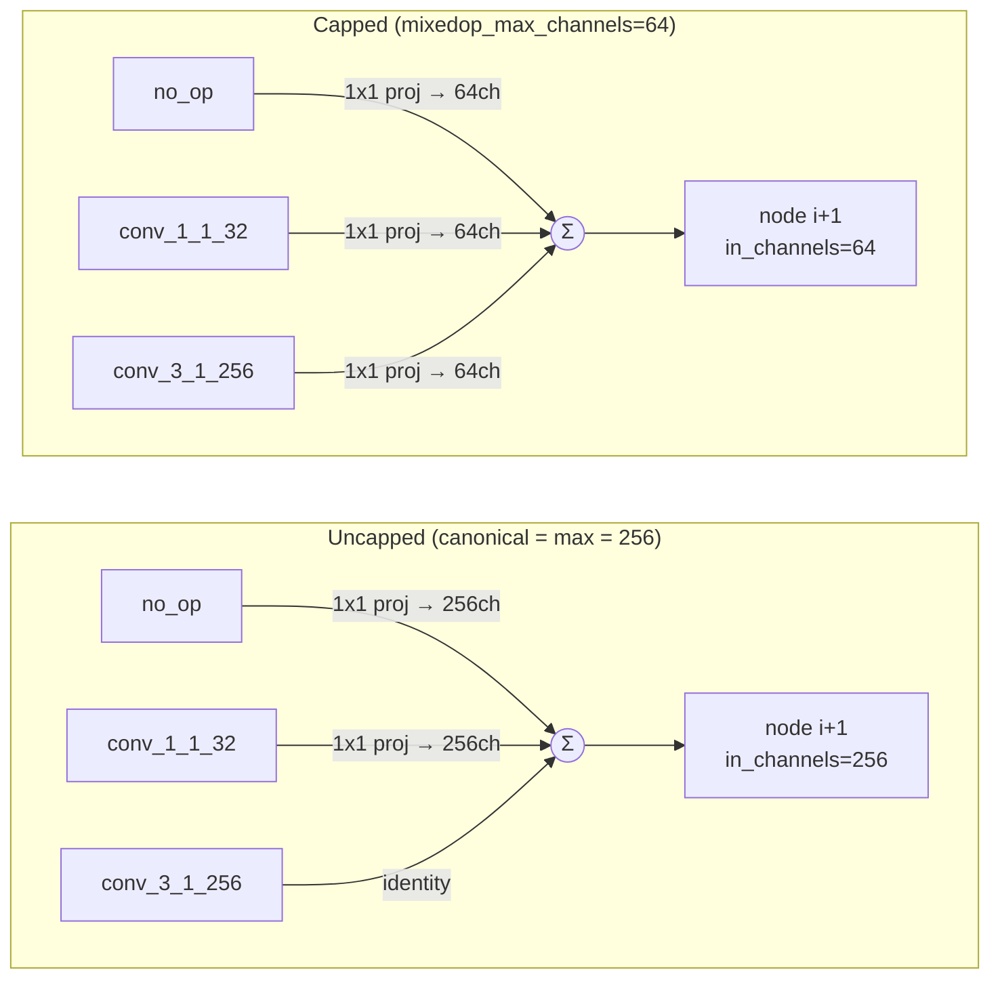
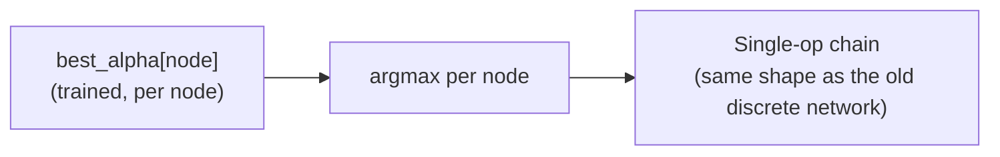
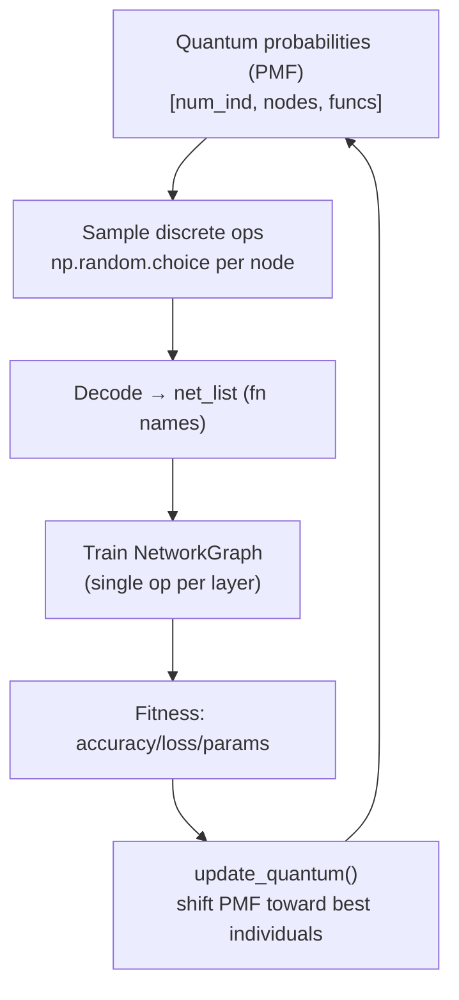
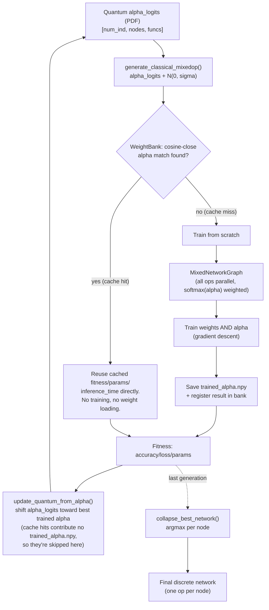
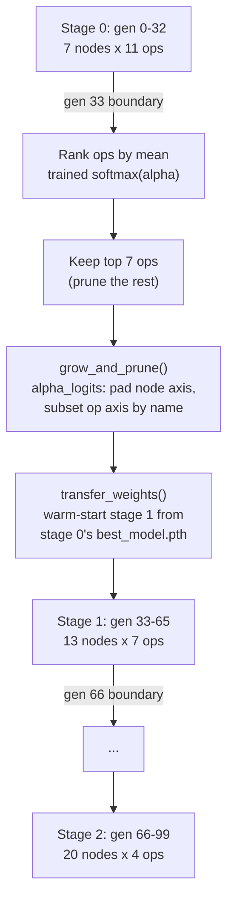

# QNAS: Discrete (PMF) vs MixedOp (PDF) — Architecture & Flow Diagrams

Comparison of the original discrete-sampling QNAS design and the new `mixedop_mode`
(DARTS-style MixedOperation with alpha-based weight reuse).

## 1. Network architecture — nodes & edges

### Old: discrete chain (one operation sampled per node)



Each node has exactly **one incoming edge type** — the operation chosen by
`np.random.choice` from the PMF (`src/population.py: generate_classical`).

### New: MixedOp node (all operations in parallel, softmax(alpha)-weighted edges)



Every node fans out to **all candidate ops simultaneously** (edges weighted by
`softmax(alpha)`), aligned in channels/spatial size, then summed — this is `MixedOp` in
[`src/cnn/mixed_model.py`](../src/cnn/mixed_model.py).

### Memory optimization: capped canonical channel width (PC-DARTS-style)

By default, `canonical_out_channels` at each node is `max()` over every candidate op's
output width. With a `fn_list` that includes a wide conv (e.g. `conv_3_1_256`), **every**
op — including cheap ones like `no_op` and `max_pool_2_2` — gets projected up to 256
channels before the weighted sum, and that width then becomes the next node's
`in_channels`, compounding across all `max_num_nodes` layers.



Setting `mixedop_max_channels` in the config's `train:` section (see
`config_mixedop.yml`) caps `canonical_out_channels` at that value instead of following
the widest op. This is the same idea PC-DARTS uses to bound search-time memory: every
op's output — even the naturally-wide one — gets projected down to the cap, so channel
width no longer grows unboundedly with the widest entry in `fn_list`. Because the capped
width also becomes the next node's `in_channels`, the saving compounds with depth
(conv FLOPs/activation memory scale with `in_channels × out_channels`), which is why a
modest cap (e.g. 64 vs. 256) cuts total parameters by ~75% in practice.

Trade-off: the wide op's own internal computation is unaffected (it still runs at its
configured filter count, e.g. 256, before being projected down), so it doesn't reduce
that op's own peak activation — only what propagates onward. It does mean a wide op's
full representation is squeezed through the same bottleneck as every other candidate,
which can bias the learned alpha logits against wide/expensive ops during search. This
only affects the search-time proxy: `collapse_best_network()` only keeps the winning
*operation names*, and the retrain phase rebuilds the discrete network via
`NetworkGraph.create_functions()` at each op's full native width — uncapped.
Implementation: `MixedOp`/`MixedNetworkGraph.create_mixed_ops()` in
[`src/cnn/mixed_model.py`](../src/cnn/mixed_model.py); read from the config in
[`src/qnas_config.py`](../src/qnas_config.py) (config-file only, no CLI flag).

### End of evolution: collapse back to a discrete chain



This is the `collapse_best_network()` step in [`src/qnas.py`](../src/qnas.py), run once
at the end of `evolve()` when `mixedop_mode` is enabled.

## 2. Evolutionary flow

### Old flow



### New flow



## 3. Progressive depth growth + operation pruning (P-DARTS-style)

By default `max_num_nodes`/`fn_list` are fixed for the whole run. Setting
`progressive_stages` in the config's `QNAS:` section instead grows the network in stages —
starting shallow with the full op set, then trading op-set width for depth as the search
progresses, warm-starting each new stage from the previous stage's best model:

```yaml
progressive_stages:
  - {gen_start: 0,  num_nodes: 7,  num_ops: 11}   # stage 0: full op set, shallow
  - {gen_start: 33, num_nodes: 13, num_ops: 7}    # stage 1: pruned, deeper
  - {gen_start: 66, num_nodes: 20, num_ops: 4}    # stage 2: narrow, full depth
```



**Op pruning** ranks candidates by mean trained softmax(alpha) weight across the whole
population and all nodes at the end of the finishing stage, then keeps the top `num_ops`
— `QNAS._rank_and_prune_ops()` in [`src/qnas.py`](../src/qnas.py). This is a global
per-fn_list ranking rather than true P-DARTS's per-edge pruning, since this codebase
shares one op set across all nodes already.

**Depth/op-set resize** — `alpha_logits` (shape `[num_ind, nodes, ops]`) is fixed-shape
for the whole run by default; `QPopulationNetwork.grow_and_prune()` in
[`src/population.py`](../src/population.py) resizes it at a stage boundary: new node rows
start at zero logits (uniform softmax, matching `initialize_alpha_logits`'s convention),
and the op axis is subset to the pruned `fn_list`, matched **by name** (not position,
since pruning reorders indices).

**Weight warm-start** is what makes staged growth actually cheaper than restarting from
scratch each stage. Because `mixedop_max_channels` (§1 above) already fixes the canonical
channel width across the whole run, the first `old_num_nodes` nodes of the deeper stage
have *identical* channel shapes to the shallower stage's model — so
`transfer_weights()` in [`src/cnn/mixed_model.py`](../src/cnn/mixed_model.py) can copy
each surviving op's (and its channel projector's) weights directly, keyed by op name, plus
the corresponding alpha values. New nodes beyond `old_num_nodes`, and any op that didn't
survive pruning, simply keep their fresh initialization. This only applies to the single
transition generation — `EvalPopulation.warm_start_info` (set in
[`src/qnas.py`](../src/qnas.py)'s `_transition_stage()`) is cleared right after that
generation's `__call__` returns, so later generations in the same stage fall back to
normal (now same-shape, so valid again) weight-bank reuse.

**Weight bank scoping** — cosine-signature matching needs equal-length alpha vectors, so
it can't compare across a depth/op-count change. Each stage gets its own bank directory
(`weight_bank/` for stage 0, `weight_bank_stage_{n}/` for later stages) via
`EvalPopulation.set_stage_weight_bank()`, rather than trying to reconcile mismatched
shapes in one shared bank.

**Checkpointing** — `current_stage_idx` and the active `fn_list` are persisted in
`save_data()`/restored in `load_qnas_data()` alongside the existing `num_net_nodes`, so
`--continue_path` resumes mid-run at the correct stage instead of assuming the
run's original (stage-0) depth/op-set.
